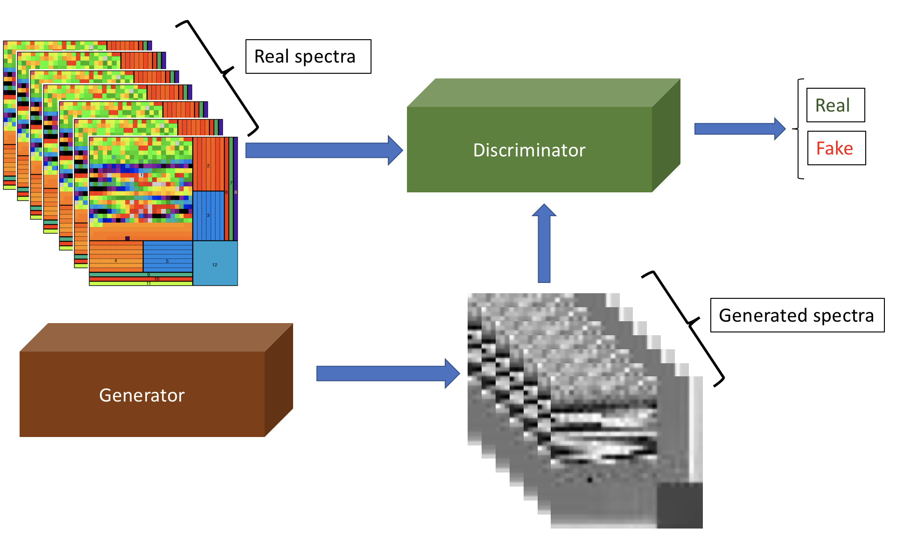
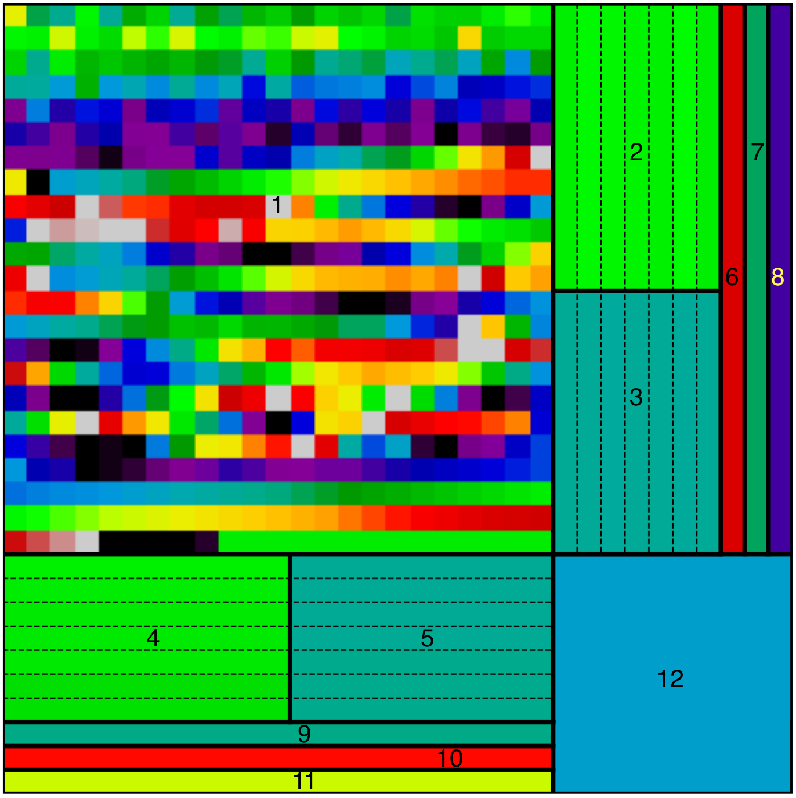
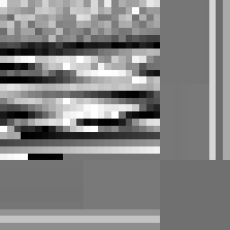
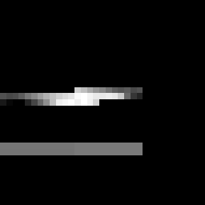
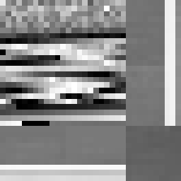
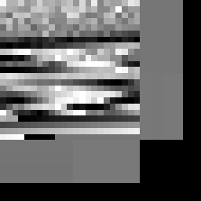
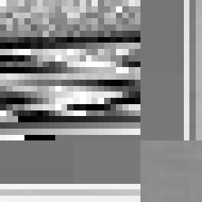

The ExoGAN code is a Deep Convolutional Generative Adversarial Network (DCGAN) trained to perform atmospheric retrievals of transmission spectra of exoplanets. ExoGAN can easily be modified to train on a diverse range of problems.
ExoGAN's scheme is made by two networks pitting one against the other during the training phase. They learn from a training set which can represent many different subjects. In our specific problem we trained a DCGAN on 10 million exoplanetary atmospheric transmission spectra generated by the TauREx retrieval code.

<figure>
	 
     <figcaption>ExoGAN scheme.</figcaption>
</figure>

The transmission spectra and the parameters necessary to generate them are assembled into a unique QR-like code called ASPA (Atmospheric Spectral and Parameters Array), defining a fingerprint for a single exoplanetary atmosphere.

<figure>
	 
     <figcaption>The Atmospheric Spectra and Parameters Array (ASPA). Each area is dedicated to a particular atmospheric characteristic: Area 1 is the spectrum between 1µm and 50µm at resolution 100 normalised between 0 and 1 in each spectral bin. Areas 2 to 5 give information about the normalisation factors used in the different section of the spectrum, clear and dark area give, respectively, information about the maximum values and the minimum values. In areas 6 to 8 we encode the atmospheric trace-gas volume mixing ratios of CO2, CO and CH4 respectively. Areas 9 to 11 are, respectively Mp, Rp and Tp. Area 12 gives information on the H2O trace-gas volume mixing ratio.</figcaption>
</figure>

Using the inpainting technique introduced by Brandon Amos (<http://bamos.github.io/2016/08/09/deep-completion>) ExoGAN reconstructs both the parameters array and any missing part of the spectrum. 

<figure>
	 
	 
	 
     <figcaption> Left: input spectrum together with the parameters pixels. Centre: masked ASPA leaving Hubble/WFC3 wavelengths only. Right: ExoGAN completed ASPA given the middle ASPA.</figcaption>
</figure>

<figure>
	 
	 
	 
     <figcaption> Same of previous figure but only masking the atmospheric forward model parameters.</figcaption>
</figure>

ExoGAN is able to analyse exoplanetary atmosphere and provides a very well constrained parameters space for atmospheric parameters. It returns results with an unprecedented speed endependently on the complexity of the atmospheric model we use. Deep Learning solution can offer us the possibility of including much more complex models in our atmospheric analysis and solve many computing-intensive tasks.

These sets of pages will be populated with installation instructions and how-to tutorials. If you have a specific question, please email Tiziano Zingales (tiziano.zingales.15@ucl.ac.uk) or Ingo Waldmann (ingo@star.ucl.ac.uk).

## Code repository

ExoGAN is available on GitHub:

<https://github.com/ucl-exoplanets/ExoGAN_public>

the training data (10 million transmission spectra) can be found here:

<https://osf.io/6dxps/>

## References
Zingales T., Waldmann I.P., AJ accepted, arXiv:1806.02906

## Active developers
- Tiziano Zingales
- Ingo Waldmann

## License
This work is licensed under the Creative Commons Attribution 4.0 International License.

We would like to draw your attention to Section 3 of the license and to:
- retain identification of the creators by including the above listed references in future work and publications.
- indicate if You modified the Licensed Material and retain an indication of any previous modifications

To view a copy of this license, visit <http://creativecommons.org/licenses/by/4.0/> or send a letter to Creative Commons, PO Box 1866, Mountain View, CA 94042, USA.
